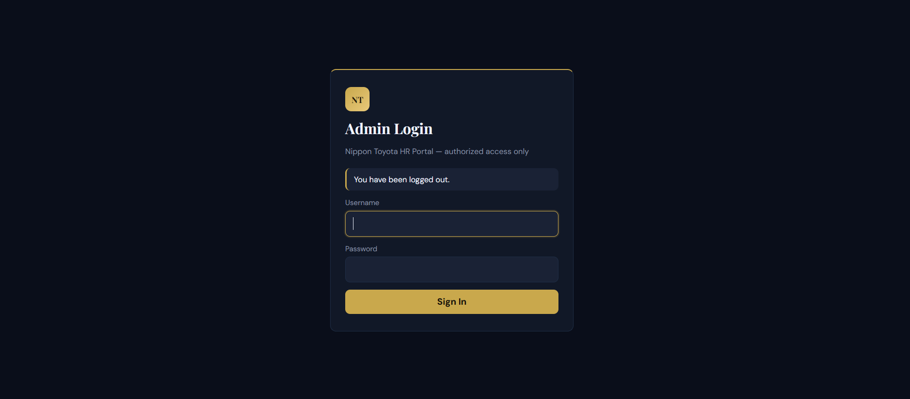
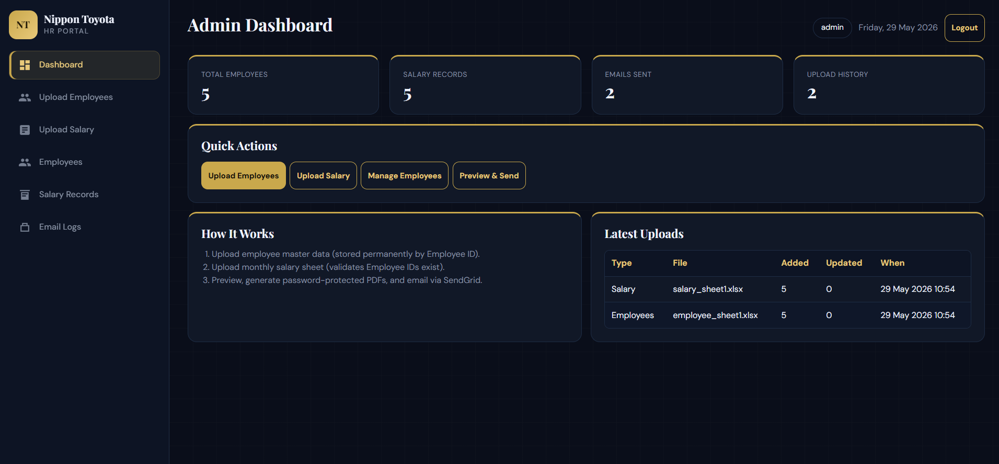
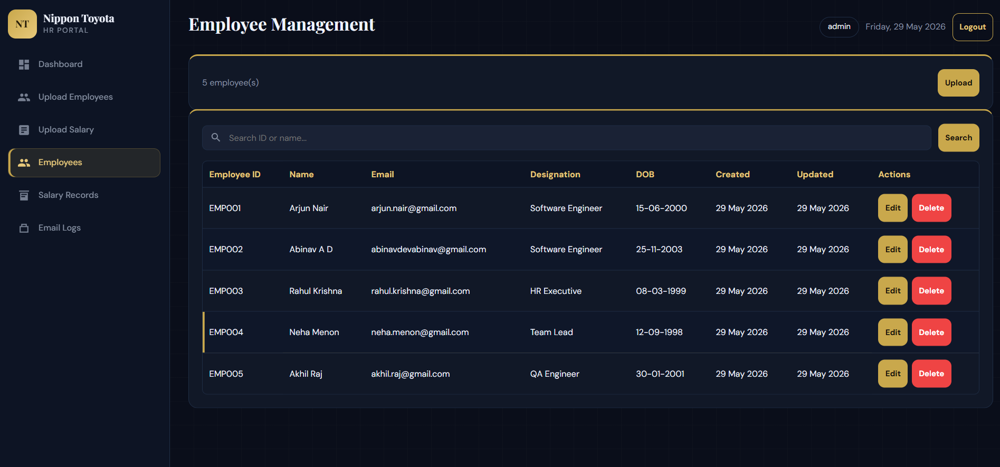
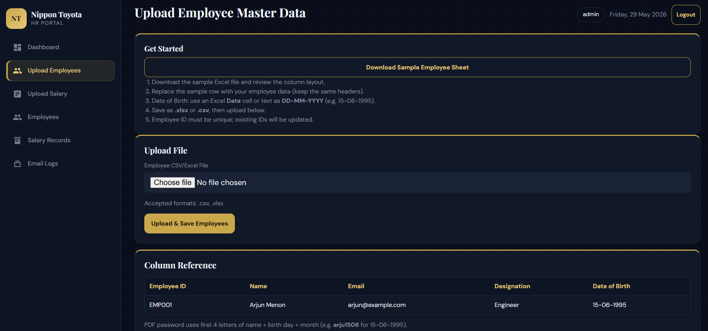
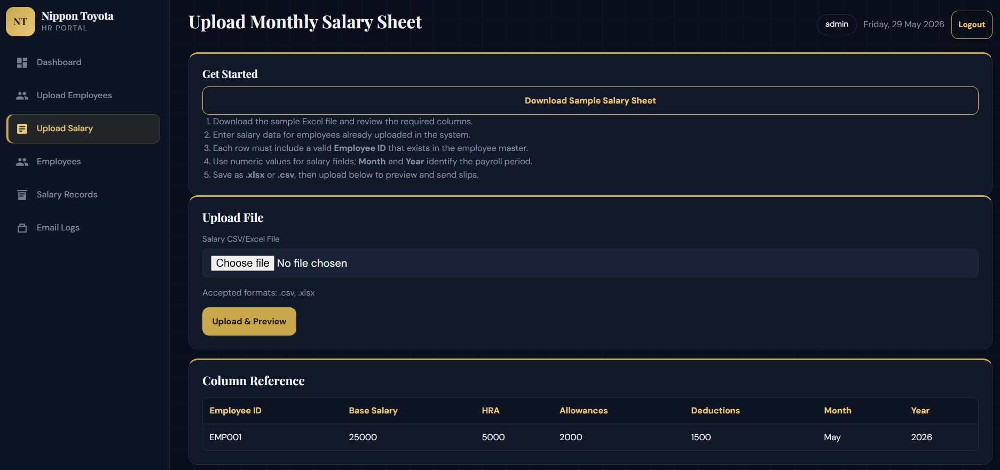
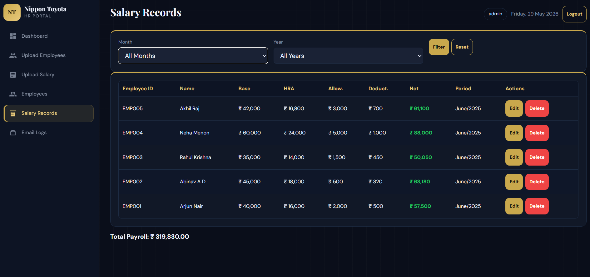
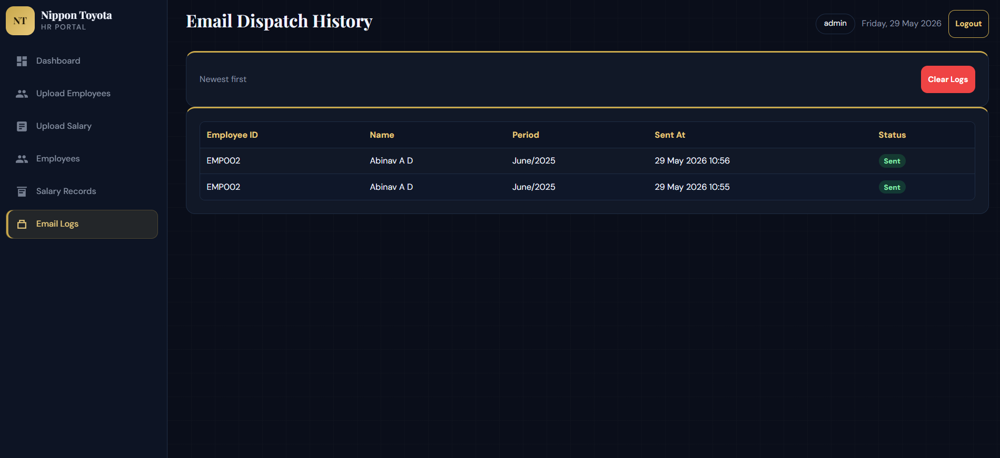
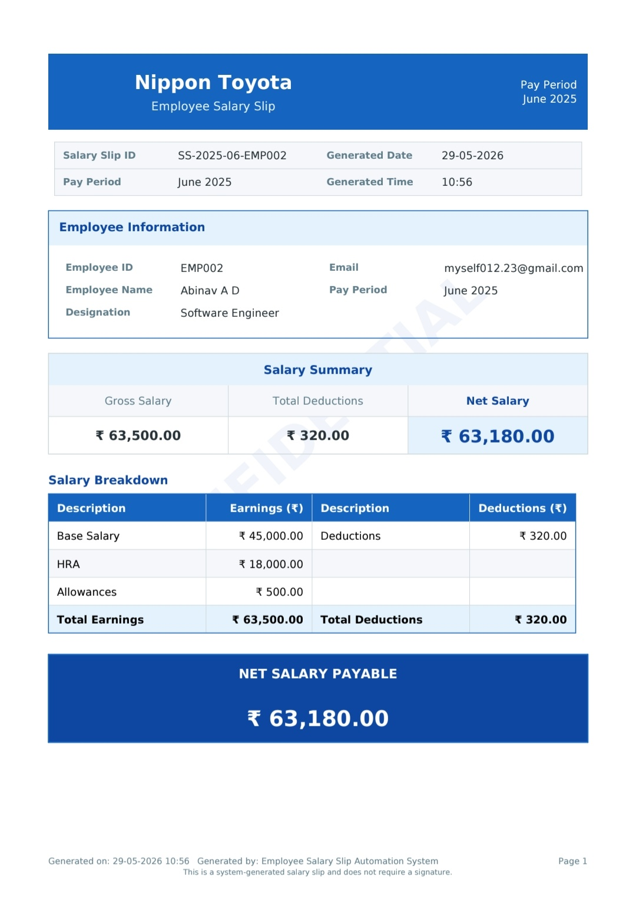
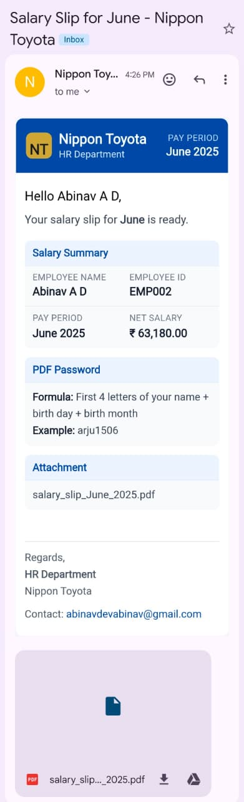

# Employee Salary Slip Automation System

> Built for Nippon Toyota | Internship Task 1 Submission

An automated payroll system that generates professional PDF salary slips and emails them directly to employees — built with Python Flask.

---

## Live Demo

- **App URL:** https://salary-slip-automation-system.onrender.com
- **Admin Username:** `admin`
- **Admin Password:** `ChangeMe@2026`

> **Important Notes:**
>
> - App is hosted on Render free tier — may take 30–50 seconds to load on first visit (free tier spins down after inactivity).
> - Salary slip emails are sent via SendGrid API (free tier). Emails may occasionally land in the **spam/junk** folder — this is **not** an application bug. It is a known limitation of SendGrid's free tier when sending from a personal email address (without a verified custom domain). In a production environment with a verified business domain, emails would land directly in the inbox. Please check your spam folder if you don't see the email

---

## Task Overview

This project fulfills **Task 1: Employee Salary Slip Automation System**, which requires:

- Admin portal to upload employee and payroll data
- Dynamic PDF salary slip generation
- Automated email dispatch to each employee
- **Bonus:** Password-protected PDFs

---

## Features Implemented

### Core Features

- Admin login with session-based authentication
- Upload employee master data via CSV or Excel
- Upload monthly salary sheet via CSV or Excel
- Preview uploaded salary data before processing
- Dynamic PDF salary slip generation using ReportLab
- Net salary auto-calculation: `(Base Salary + HRA + Allowances) - Deductions`
- Automated email dispatch with PDF attachment via SendGrid API
- Professional HTML email template with employee name and payment month

### Bonus Feature

- Password-protected PDF salary slips
- Password formula: first 4 letters of name (lowercase) + birth day + birth month
- Example: Arjun Menon born 15th June → password is `arju1506`
- Email contains only the formula hint — not the actual password (for security)

### Additional Features (Beyond Requirements)

- Employee management: view, edit, delete employees
- Salary records management: view, edit, delete records
- Email dispatch logs with timestamps and status
- Selective sending: choose specific employees via checkboxes
- Duplicate prevention: upsert logic on re-upload
- Download sample Excel files directly from the app
- Dashboard with live statistics
- Mobile-responsive admin UI with collapsible navigation
- PostgreSQL on Render for persistent data across redeploys (SQLite for local dev)
- Bulk slip dispatch UX: one batch summary after all employees finish (progress bar while processing)
- Inline empty states on list pages with call-to-action buttons (no toast spam on first login)
- Duplicate-send safeguards: deduplicated employee selection and backend record handling

---

## Tech Stack

| Layer | Technology |
|-------|------------|
| Backend | Python 3, Flask |
| Database | PostgreSQL (production) / SQLite (local dev) with SQLAlchemy ORM |
| PDF Generation | ReportLab |
| PDF Encryption | pikepdf |
| Email | SendGrid API |
| File Parsing | Pandas, openpyxl |
| Frontend | HTML, CSS, Vanilla JavaScript |
| Deployment | Render.com |
| Database driver | psycopg2-binary (PostgreSQL) |
| Environment | python-dotenv |

---

## Database Schema

### Employee Table

| Column | Type | Description |
|--------|------|-------------|
| id | Integer | Primary key |
| employee_id | String | Unique employee identifier |
| name | String | Full name |
| email | String | Email address |
| designation | String | Job title |
| date_of_birth | Date | Date of birth (stored as DATE; shown as DD-MM-YYYY) |
| created_at | DateTime | Record created timestamp |
| updated_at | DateTime | Last updated timestamp |

### SalaryRecord Table

| Column | Type | Description |
|--------|------|-------------|
| id | Integer | Primary key |
| employee_id | String | Foreign key to Employee |
| base_salary | Float | Basic salary |
| hra | Float | House rent allowance |
| allowances | Float | Other allowances |
| deductions | Float | Total deductions |
| net_salary | Float | Calculated net pay |
| month | String | Pay month |
| year | Integer | Pay year |

### EmailLog Table

| Column | Type | Description |
|--------|------|-------------|
| id | Integer | Primary key |
| employee_id | String | Employee reference |
| employee_name | String | Name at time of sending |
| month | String | Pay period month |
| year | Integer | Pay period year |
| sent_at | DateTime | Timestamp of send |
| status | String | `success` or `failed` |

### UploadLog Table

| Column | Type | Description |
|--------|------|-------------|
| id | Integer | Primary key |
| upload_type | String | `employees` or `salary` |
| file_name | String | Uploaded file name |
| records_added | Integer | New records count |
| records_updated | Integer | Updated records count |
| uploaded_at | DateTime | Upload timestamp |

---

## Project Structure

```
salary-slip-app/
├── app.py                  # Main Flask app, all routes
├── config.py               # Configuration settings
├── models.py               # SQLAlchemy database models
├── requirements.txt        # Python dependencies
├── gunicorn.conf.py        # Production server config
├── Procfile                # Render start command
├── render.yaml             # Render deployment blueprint
├── .env.example            # Environment variable template
├── templates/
│   ├── base.html           # Base layout with sidebar
│   ├── login.html          # Admin login page
│   ├── dashboard.html      # Main dashboard
│   ├── upload_employees.html
│   ├── upload_salary.html
│   ├── preview.html        # Salary preview + batch send (summary UI)
│   ├── partials/
│   │   └── empty_state.html  # Reusable inline empty-state card
│   ├── employees.html      # Employee management
│   ├── edit_employee.html
│   ├── salary_records.html
│   ├── edit_salary.html
│   └── email_logs.html
├── utils/
│   ├── pdf_generator.py    # ReportLab PDF + pikepdf encryption
│   ├── email_sender.py       # SendGrid API email sending
│   ├── csv_parser.py         # Pandas file parsing
│   ├── dob_util.py           # Date of birth parsing & validation
│   ├── sample_templates.py   # Dynamic Excel sample downloads
│   ├── slip_service.py       # PDF + email orchestration
│   ├── auth.py               # Admin authentication
│   ├── db_migrate.py         # Schema upgrades (SQLite + PostgreSQL)
│   ├── ui_helpers.py         # Flash filtering (empty states vs actions)
│   ├── paths.py              # Upload/PDF path helpers
│   └── logging_config.py     # Logging setup
├── uploads/                # Temporary uploaded files
└── generated_pdfs/         # Generated salary slip PDFs
```

Sample Excel templates are generated on demand via `/download/sample-employees` and `/download/sample-salary` (no static files required).

---

## How to Test the Live App

### Step 1 — Login

1. Go to [https://salary-slip-automation-system.onrender.com](https://salary-slip-automation-system.onrender.com)
2. Login with: `admin` / `ChangeMe@2026`

### Step 2 — Upload Employees

1. Go to **Upload Employees**
2. Click **Download Sample Employee Sheet** or use your own file
3. Required columns: `Employee ID`, `Name`, `Email`, `Designation`, `Date of Birth`
4. **Date of Birth:** Excel date cell **or** text as **DD-MM-YYYY** (e.g. `15-06-1995`)
5. Upload the file and confirm success on the dashboard

### Step 3 — Upload Salary Sheet

1. Go to **Upload Salary**
2. Click **Download Sample Salary Sheet** or use your own file
3. Required columns: `Employee ID`, `Base Salary`, `HRA`, `Allowances`, `Deductions`, `Month`, `Year`
4. Employee IDs must already exist in the employee master
5. Upload the file — you will be redirected to the preview page

### Step 4 — Generate & Send

1. On the **Preview** page, select specific employees or **Select All**
2. Click **Generate & Send** — the button disables and a **progress bar** runs while each employee is processed (one request per employee on Render free tier)
3. When finished, a **single summary card** appears, for example:

   **Salary Slip Generation Completed**  
   Total Processed: 4 · Successfully Sent: 4 · Failed: 0

4. Each successful employee receives their password-protected salary slip PDF via email

> **Tip:** Use **Email Logs** for per-employee send status and timestamps — not repeated on-screen toasts.

> **Note on Email Delivery:** Emails are sent via SendGrid API (free tier). If the email does not appear in the inbox, please check the **spam/junk** folder. This is **not** an application bug — it is a known limitation of SendGrid free tier when used with a personal email address without a verified custom domain. In a production environment with a verified business domain, emails would land directly in the inbox.

### Step 5 — Check Email Logs

1. Go to **Email Logs** to see dispatch history with timestamps and status (`success` / `failed`)

---

## Sample File Format

### Employee Sheet

| Employee ID | Name | Email | Designation | Date of Birth |
|-------------|------|-------|-------------|---------------|
| EMP001 | Arjun Menon | arjun@example.com | Engineer | 15-06-1995 |

### Salary Sheet

| Employee ID | Base Salary | HRA | Allowances | Deductions | Month | Year |
|-------------|-------------|-----|------------|------------|-------|------|
| EMP001 | 45000 | 18000 | 5000 | 3200 | June | 2025 |

---

## Password Protected PDFs (Bonus Feature)

Each generated salary slip is automatically password protected using **pikepdf**.

**Password formula:**

- First 4 letters of employee first name (lowercase) + birth day + birth month  
- Example: Arjun Menon born on 15th June → password: `arju1506`

The email sent to employees contains only the **formula hint** — never the actual password — so intercepted emails cannot be used to open the PDF.

---

## Local Setup Instructions

### Prerequisites

- Python 3.10+
- pip

### Steps

**1. Clone the repository**

```bash
git clone https://github.com/abinavdev/salary-slip-app.git
cd salary-slip-app
```

**2. Create virtual environment**

```bash
python -m venv venv
```

Windows:

```powershell
.\venv\Scripts\Activate.ps1
```

Mac/Linux:

```bash
source venv/bin/activate
```

**3. Install dependencies**

```bash
pip install -r requirements.txt
```

**4. Create `.env` file**

```bash
cp .env.example .env
```

Fill in your values:

```env
SECRET_KEY=your-secret-key
SENDGRID_API_KEY=your-sendgrid-api-key
FROM_EMAIL=your-verified-sender@example.com
ADMIN_USERNAME=admin
ADMIN_PASSWORD=ChangeMe@2026
FLASK_ENV=development
```

**Database (local):** Do not set `DATABASE_URL`. The app automatically creates and uses `salary_system.db` in the project folder.

**Database (optional):** To test against PostgreSQL locally, set `DATABASE_URL` to your Postgres connection string in `.env`.

**5. Run the app**

```bash
python app.py
```

**6. Open browser**

[http://127.0.0.1:5000](http://127.0.0.1:5000)

---

## Deployment

Deployed on **Render.com** free tier at [https://salary-slip-automation-system.onrender.com](https://salary-slip-automation-system.onrender.com).

### Render PostgreSQL Setup

1. In the [Render Dashboard](https://dashboard.render.com), open your web service **salary-slip-automation-system**.
2. Click **New** → **PostgreSQL** (or use the `databases` section in [`render.yaml`](render.yaml)).
3. Name the database `salary-slip-db` (must match `render.yaml` if using Blueprint).
4. After the database is created, go to the web service → **Environment**.
5. Add or confirm these variables:
   - `DATABASE_URL` — link from the PostgreSQL instance (Render sets this automatically when linked).
   - `INSTANCE_PATH` — set to `/tmp` (writable storage for uploads and generated PDFs).
6. Ensure secrets are set: `SECRET_KEY`, `ADMIN_USERNAME`, `ADMIN_PASSWORD`, `SENDGRID_API_KEY`, `FROM_EMAIL`.
7. **Manual deploy** or push to GitHub to trigger a redeploy.
8. Verify: open `https://salary-slip-automation-system.onrender.com/health` — `"database": true`.

Tables are created automatically on first startup via `db.create_all()`. No migration script is required for a fresh PostgreSQL database.

> **Note:** Render free PostgreSQL databases expire after 90 days. Upgrade to a paid plan for long-term production use.

**Environment variables set on Render:**

| Variable | Purpose |
|----------|---------|
| `SECRET_KEY` | Flask session security |
| `SENDGRID_API_KEY` | SendGrid API key |
| `FROM_EMAIL` | Verified sender email in SendGrid |
| `ADMIN_USERNAME` | Admin login username |
| `ADMIN_PASSWORD` | Admin login password |
| `FLASK_ENV` | `production` |
| `DATABASE_URL` | Auto-injected PostgreSQL connection string (Render) |
| `INSTANCE_PATH` | `/tmp` — writable path for uploads and PDFs |

**Start command:** `gunicorn -c gunicorn.conf.py app:app`

---

## Developer Notes

- Built using Visual Studio Code (VS Code) with development assistance from  Cursor AI and ChatGPT
- All architectural decisions, debugging, and deployment handled manually
- Tested locally on Windows, verified across desktop and mobile devices for responsive user experience, and deployed on Linux (Render)
- SendGrid API used for reliable cloud email delivery (no SMTP port blocking)
- PostgreSQL on Render for persistent employee/salary/email data; SQLite used automatically for local development when `DATABASE_URL` is unset
- Render `postgres://` URLs are normalized to `postgresql://` automatically for SQLAlchemy compatibility
- Email spam behaviour is a known limitation of SendGrid free tier with personal email addresses — **not** an application defect. Production deployment with a verified custom domain would resolve this completely.
- Date of birth supports Excel date cells, `DD-MM-YYYY` text, and `YYYY-MM-YYYY` text with automatic conversion
- Preview batch send: `templates/preview.html` + `utils/ui_helpers.py` (`is_action_flash`) keep the UI professional for large payroll runs

---

## Application Screenshots

### Admin Authentication


### Dashboard


### Employee Management


### Upload Employee Data


### Upload Salary Data


### Salary Records


### Email Logs


### Generated Salary Slip PDF


### Salary Slip Email Template


---

**Nippon Toyota | Internship Submission — Task 1**
